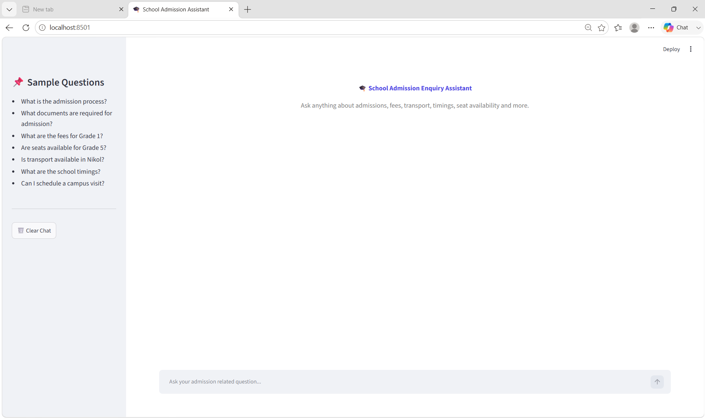
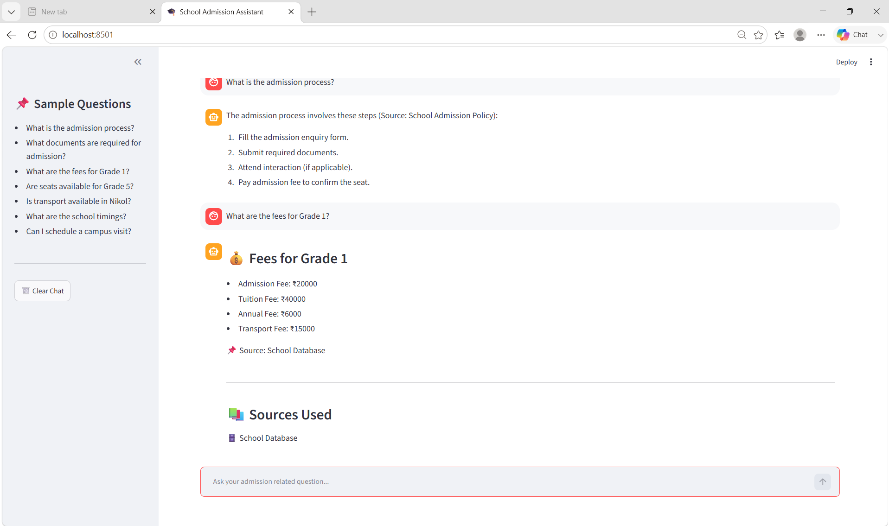
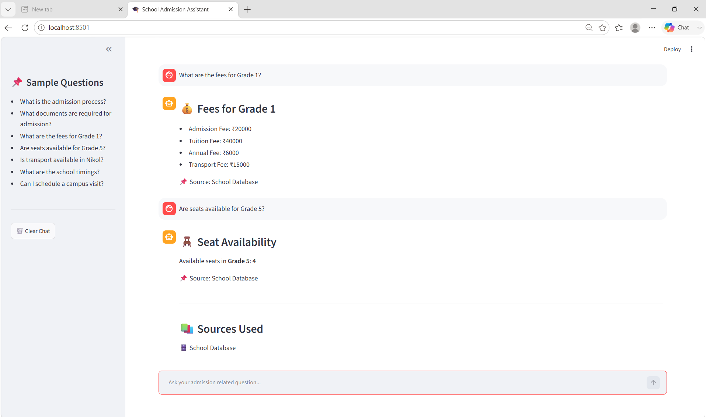
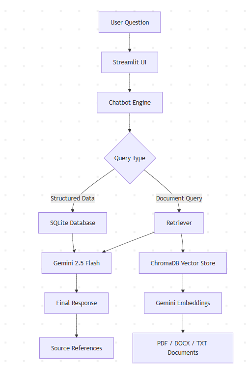
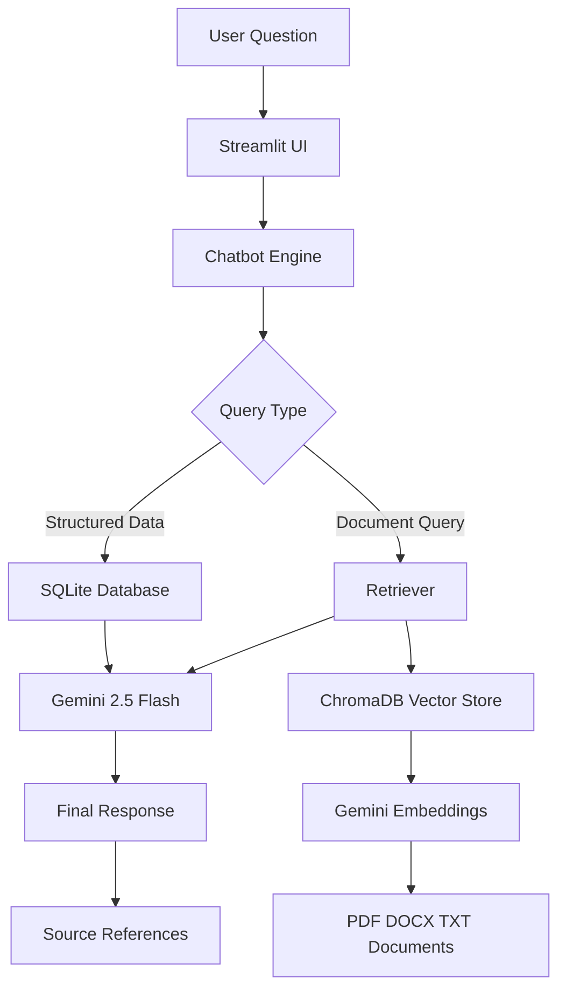

# 🎓 School Admission Enquiry Assistant

An AI-powered School Admission Enquiry Assistant built using **Gemini 2.5 Flash**, **RAG Architecture**, **ChromaDB**, and **SQLite Database**.

The assistant can answer admission-related questions by combining information from documents (PDF, DOCX, TXT) and structured database records.

---

# 🚀 Features

✅ Admission Process Queries  
✅ Fee Structure Queries  
✅ Required Documents Information  
✅ Transport Availability Check  
✅ School Timings Information  
✅ Seat Availability Information  
✅ Campus Visit Information  
✅ Source References for Answers  
✅ Retrieval Augmented Generation (RAG)  
✅ Database + Document Integration

---

# 🏗️ Architecture

User Query
↓
Streamlit UI
↓
Chatbot Engine
↓
Query Router
├── SQLite Database
└── ChromaDB Vector Database
↓
Gemini 2.5 Flash
↓
Final Response

---

# 🛠️ Tech Stack

- Python
- Gemini 2.5 Flash
- LangChain
- ChromaDB
- SQLite
- Streamlit
- Google Generative AI Embeddings
- PyPDF
- Docx2txt

---

# 📂 Project Structure

```text
school-admission-rag/
│
├── app.py
├── requirements.txt
├── README.md
│
├── data/
│   ├── school.db
│   ├── pdfs/
│   ├── docs/
│   └── txt/
│
├── database/
│   ├── create_db.py
│   ├── seed_data.py
│   └── check_db.py
│
├── rag/
│   ├── loader.py
│   ├── splitter.py
│   ├── embeddings.py
│   ├── vector_store.py
│   ├── retriever.py
│   ├── prompts.py
│   └── chatbot.py
│
├── chroma_db/
│
└── screenshots/
```

# 📄 Supported Data Sources

## Unstructured Data

- PDF Documents
- DOCX Files
- TXT Files

## Structured Data

- Fees Data
- Seat Availability
- Transport Availability
- FAQs
- School Information

---

# ⚙️ Installation

## Clone Repository

```bash
git clone https://github.com/ankitaimlengineer/school-admission-rag.git
cd school-admission-rag
```

## Create Virtual Environment

```bash
python -m venv venv
```

## Activate Virtual Environment

### Windows

```bash
venv\Scripts\activate
```

### Linux / Mac

```bash
source venv/bin/activate
```

## Install Dependencies

```bash
pip install -r requirements.txt
pip install streamlit langchain langchain-google-genai langchain-community chromadb python-dotenv pypdf docx2txt

---

# 🔑 Environment Variables

Create a `.env` file in the root directory.

```env
GOOGLE_API_KEY=your_google_api_key
```

---

# ▶️ Running the Application

```bash
streamlit run app.py
```

---

# 💬 Sample Questions

- What is the admission process?
- What are the fees for Grade 1?
- Are seats available for Grade 5?
- What documents are required for admission?
- Is transport available in Nikol?
- What are the school timings?
- Can I schedule a campus visit?

---


---

### 3. Screenshots section માં actual images મૂકો

```md
# 📸 Screenshots

## Home Screen


## Fees Query


## Seat Availability Query


# 🔍 Example Queries

## Fees Query

**Question**

```text
What are the fees for Grade 1?
```

**Answer**

```text
Admission Fee : ₹20000
Tuition Fee : ₹40000
Annual Fee : ₹6000
Transport Fee : ₹15000
```

---

## Seat Availability Query

**Question**

```text
Are seats available for Grade 5?
```

**Answer**

```text
Available seats in Grade 5: 4
```

---

# 📈 Future Improvements

- Voice Support
- Multilingual Support
- Parent Login Portal
- Online Admission Form
- WhatsApp Integration
- Email Notifications

---

# 👨‍💻 Developed By

Ankit Thummar

AI Internship Assessment Project


## Architecture Diagram







# 📜 License

This project was developed as part of an AI Internship Assessment.


# ✅ Project Status

Completed and ready for deployment.